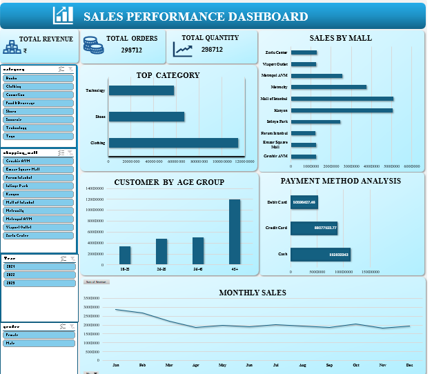

# Shopping-Mall-Sales-Dashboard
Interactive Excel dashboard analyzing shopping mall sales performance across categories, malls, age groups, and payment methods | Data Analytics Portfolio

# 🛍️ Shopping Mall Sales Performance Dashboard

## 📌 Project Overview

An interactive **Microsoft Excel dashboard** analyzing retail sales performance across multiple shopping malls in Turkey. Built entirely in Excel using Pivot Tables, Slicers, and Charts — this project uncovers revenue trends, customer behavior, and payment preferences to support data-driven retail decisions.

---

## 📊 Dashboard Overview

One-page interactive dashboard with the following visuals:

| Visual | Insight Delivered |
|---|---|
| KPI Cards | Total Revenue, Total Orders, Total Quantity |
| Top Category (Bar Chart) | Revenue by product category |
| Sales by Mall (Bar Chart) | Mall-wise performance comparison |
| Customer by Age Group | Revenue segmentation across age brackets |
| Payment Method Analysis | Debit Card vs Credit Card vs Cash |
| Monthly Sales Trend | Full-year seasonality pattern (Jan–Dec) |

---

## 🔍 Key Findings

- 🏆 **Technology** is the highest revenue-generating category, followed by Shoes and Clothing
- 🏬 **Kanyon Mall** leads in total sales among all locations
- 👥 **45+ age group** contributes the highest revenue — a critical customer segment
- 💳 **Debit Card** is the dominant payment method by revenue value
- 📉 **Monthly Sales** show a mid-year dip with recovery toward year-end
- 📅 Data spans **2021–2023** across 10 mall locations

---

## 🛠️ Tools & Skills Used

- **Microsoft Excel** — Dashboard design and layout
- **Pivot Tables** — Data aggregation and summarization
- **Slicers** — Interactive filtering (Category, Mall, Year, Gender)
- **Excel Charts** — Bar charts, line chart, horizontal bars
- **Data Cleaning** — Handled within Excel

---

## 📁 Dataset

- **Source:** Shopping Mall Customer Transactions Dataset
- **Records:** 298,712 orders
- **Scope:** 10 malls, multiple product categories, age groups, genders, payment methods
- **Years Covered:** 2021, 2022, 2023

---

## 🎯 Business Questions Answered

1. Which product categories drive the most revenue?
2. Which malls are top and bottom performers?
3. What age group spends the most?
4. How do customers prefer to pay?
5. Are there seasonal sales patterns throughout the year?

---

## 📸 Dashboard Preview

---

## 🚀 How to Use

1. Download the `.xlsx` file from this repository
2. Open in **Microsoft Excel** (2016 or later recommended)
3. Use the slicers on the left to filter by Category, Mall, Year, and Gender
4. All charts update dynamically based on your selections

---

## 👩‍💻 About the Author

**Mohini Mishal**  
BCA Student | Aspiring Data Analyst  
📍 Centurion University of Technology and Management (CUTM)

)

---

## 📂 Portfolio Projects

| # | Project | Tools | Status |
|---|---|---|---|
| 1 | Amazon Sales Dashboard | Power BI, DAX | ✅ Completed |
| 2 | Shopping Mall Sales Dashboard | Excel, Pivot Tables | ✅ Completed |
| 3 | Coming Soon | Python / SQL | 🔄 In Progress |

---

> *"Data is only as valuable as the story it tells."*
